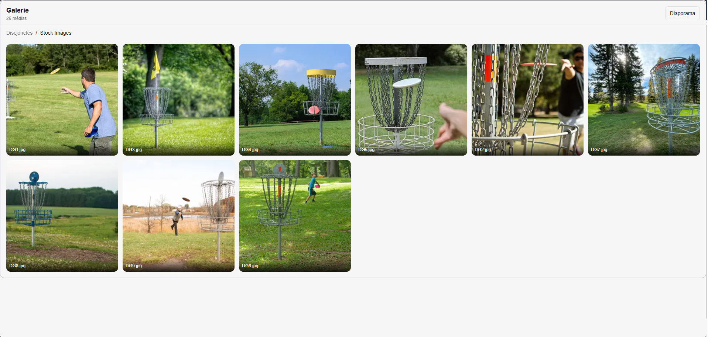
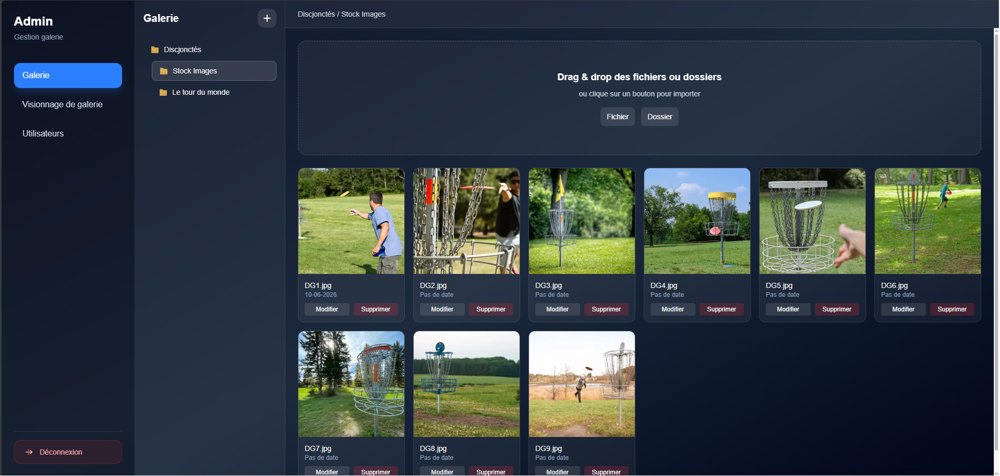
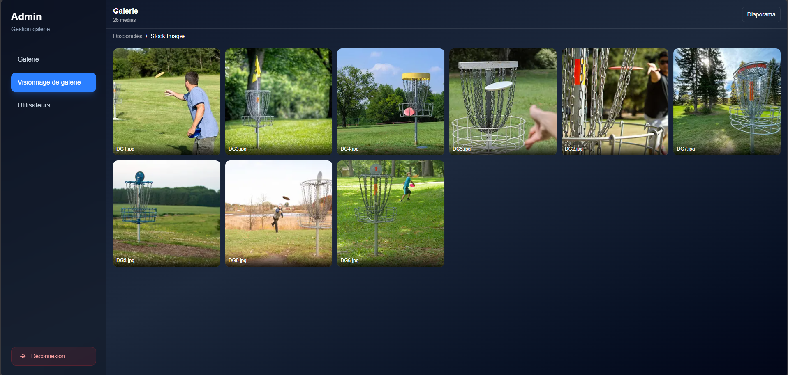
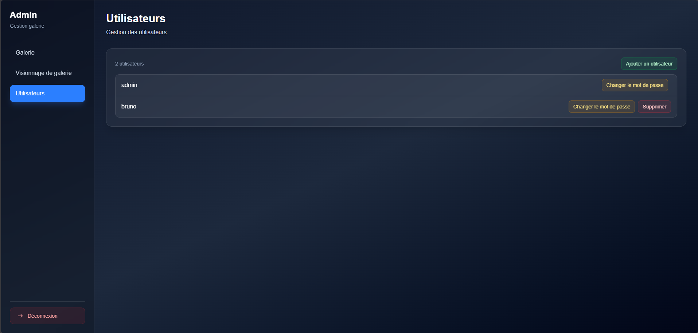

# Disc Golf Gallery

Application web permettant la gestion et l'affichage d'une galerie photo pour une association sportive.

Le projet est composé d'une interface publique destinée à l'affichage des photos sous forme de diaporama ainsi que d'un back-office permettant aux administrateurs de gérer les utilisateurs et le contenu de la galerie.

## Aperçu

### Galerie publique



### Back-office

| Galerie | Visionnage | Utilisateurs |
|---------|------------|--------------|
|  |  |  |

## Fonctionnalités

### Galerie publique

- Affichage des photos en plein écran
- Diaporama automatique
- Intégration via iframe sur le site de l'association
- Affichage optimisé pour un écran dédié

### Back-office

- Authentification des administrateurs
- Gestion des utilisateurs
- Upload de photos
- Modification des métadonnées d'une photo
- Suppression de photos
- Prévisualisation des images

## Stack technique

- Next.js
- React
- TypeScript
- PostgreSQL
- Prisma
- Redis (Upstash)
- Cloudinary
- Vercel

## Architecture

```
                    Client
                       │
                       ▼
                Next.js / React
                       │
        ┌──────────────┼──────────────┐
        ▼              ▼              ▼
    PostgreSQL      Redis         Cloudinary
    Métadonnées     Sessions      Images
```

## Déploiement

Le projet est déployé sur **Vercel**.

Les variables d'environnement nécessaires sont :

```env
DATABASE_URL=
UPSTASH_REDIS_REST_URL=
UPSTASH_REDIS_REST_TOKEN=
CLOUDINARY_CLOUD_NAME=
CLOUDINARY_API_KEY=
CLOUDINARY_API_SECRET=
```

## Installation

```bash
git clone https://github.com/...
cd dgg

pnpm install

pnpm dev
```

L'application est ensuite accessible sur :

```
http://localhost:3000
```

## Structure du projet

```
app/
└─admin/
└─api/
└─gallery/
└─login/
components/
hooks/
lib/
prisma/
types/
```

## Objectifs du projet

Ce projet a été développé dans le cadre d'une mission bénévole pour une association sportive.

Les principaux objectifs étaient :

- migration de l'ancienne galerie sur le nouveau site
- proposer un outil d'administration simple
- permettre un affichage automatique des photos sur le site de l'association
- disposer d'une solution facilement déployable et peu coûteuse

## Choix techniques

- **Next.js** pour bénéficier du routage par fichiers et des API Routes dans une seule application.
- **Prisma** pour simplifier l'accès aux données et les migrations de base de données.
- **PostgreSQL** pour le stockage relationnel des métadonnées.
- **Redis (Upstash)** pour stocker les sessions utilisateur avec une faible latence.
- **Cloudinary** pour externaliser le stockage et l'optimisation des images.
- **Vercel** pour un déploiement continu et une intégration native avec Next.js.

## Pistes d'amélioration

- Recherche avancée
- Compression automatique des images
- Sélection multiple de médias pour suppression ou téléchargement

## Auteur

Développé par Antoine Bussière.